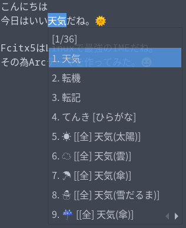

# Fcitx5 Arc Theme

Arc theme for fcitx5.



## Install

Run this command to install.

```shell
make install
```

Or, alternatively:

```shell
cp -a arc ~/.local/share/fcitx5/themes/arc
```

## Enable

Open `fcitx5-configtool`,
go to `Addon` > `Classic User Interface`,
click the settings button and apply the `Arc` theme.

You can also update `~/.config/fcitx5/conf/classicui.conf` file manually.
Just change the `Theme` to `arc`.
